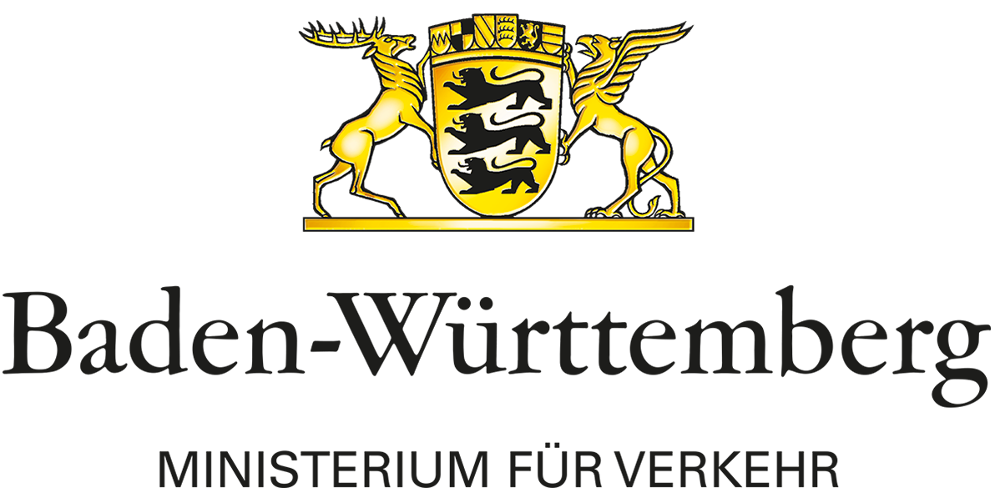

# Introduction
  

The project SmartEPark - Smart.Electric.Parking is a project aimed to create new standards and concepts for an automated valet parking system. Based on the open-source strategy of this project, this repository contains code for the parking management system, simulation models and worlds, high resolution maps of a multistorey car park and presentation slides.

## Code

### Code / ros_parking_management

Implementation of the automated valet parking system as a ROS node. Further documentation is included in the subfolder.

### Code / ros_lanelet2_visualization

Contains a ROS node to visualize lanelet2 maps in RViz.

### Code / ros_messages / ros_parking_management_msgs

ROS messages for communication between the parking management system and the traffic participants. ROS messages are converted to ASN Car2X messages and sent via the Car2X communication protocol.

### Code / ros_car2x_trajectory_conversions

ROS node for conversion of trajectories between ROS message format and Car2X message format.

## Gazebo

Files in the gazebo folder can be used to simulate and visualize the parking garage in Gazebo.

## Sumo

The sumo folder consists of sumo config and xml files which are used to simulate traffic participant behavior.

## Maps

This folder contains maps of the multistorey car park that was used to evaluate and test the concept. The maps are provided in the [Lanelets format](https://github.com/fzi-forschungszentrum-informatik/Lanelet2). 

## Presentations
Presentation slides of the SmartMobility final event that summarize the project SmartEPark.

# Terms and Conditions

## Code

The provided code is licensed by the [FZI Research Center for Information Technology](https://github.com/fzi-forschungszentrum-informatik)  under the [3-Clause BSD License](Code/LICENCE) which has also been called "New BSD License" or "Modified BSD License". Therefore the Licensor grants to the End-User the right to use the code in a commercial manner.

## Gazebo & Sumo Models, Maps & Presentations

 

Everything else in this repository by [FZI Research Center for Information Technology](https://github.com/fzi-forschungszentrum-informatik) is licensed under a [Attribution-NonCommercial-ShareAlike 4.0 International License](http://creativecommons.org/licenses/by-nc-sa/4.0).
Therefore maps, presentations and gazebo and sumo models and all other files are only allowed to be used for non-commercial purposes, such as teaching and research. The Licensor thus grants to the End User the right to use the provided files, for its own internal and non-commercial use and for the purpose of scientific research only. 

If anything in this repository is to be used in media, a link to the Licensor’s website is to be included. In case the End User uses parts of the repository or contents within the research paper, the following publication, see [online resource](https://ieeexplore.ieee.org/abstract/document/9565095),
 should be quoted:

>@inproceedings{schorner2021park,    
>  title={Park my Car! Automated Valet Parking with Different Vehicle Automation Levels by V2X Connected Smart Infrastructure},   
>  author={Sch{\"o}rner, Philip and Conzelmann, Marcus and Fleck, Tobias and Zofka, Marc and Z{\"o}llner, J Marius},   
>  booktitle={2021 IEEE International Intelligent Transportation Systems Conference (ITSC)},   
>  pages={836--843},   
>  year={2021},  
>  organization={IEEE}  
>}

# Credits
The provided code, simulation files and other documentation was developed and created by the [FZI Research Center for Information Technology](https://www.fzi.de).

The [Ministry of Transport (VM) of Baden-Württemberg](https://mwk.baden-wuerttemberg.de/de/startseite/) and the [Ministry of Science, Research and Art (MWK) of Baden-Württemberg](https://mwk.baden-wuerttemberg.de/de/startseite/) are 
sponsors and supporters of the [Smart Mobility](https://www.e-mobilbw.de/ueber-uns/projektaktivitaeten/smart-mobility) program. SmartEPark is one of the five supported projects aimed to increase understanding of autonomous driving. 
The SmartMobility programm was coordinated by [E-Mobil](https://www.e-mobilbw.de/en/).

